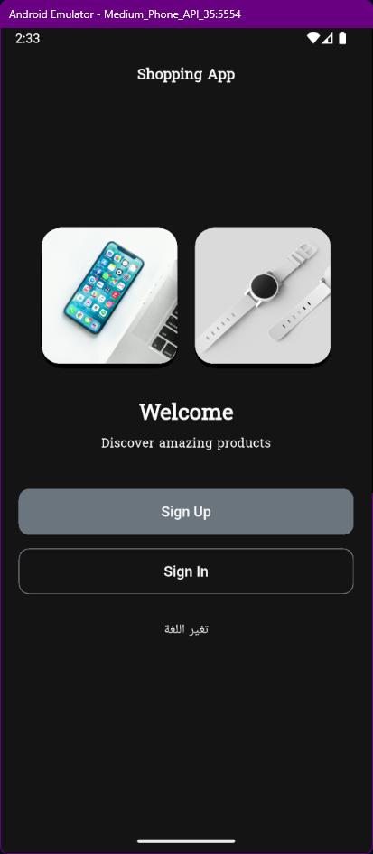
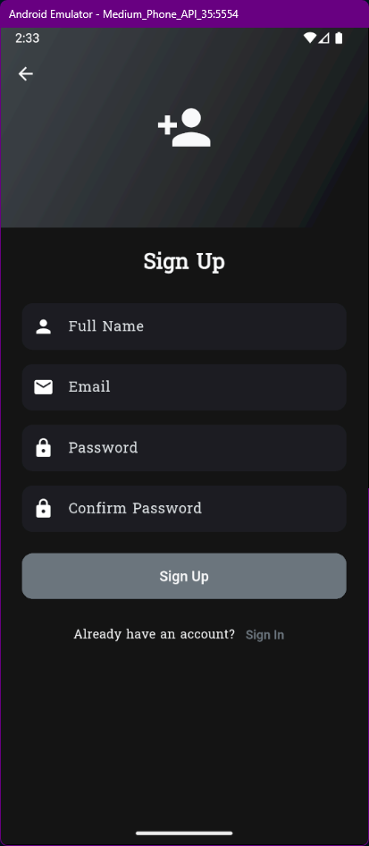
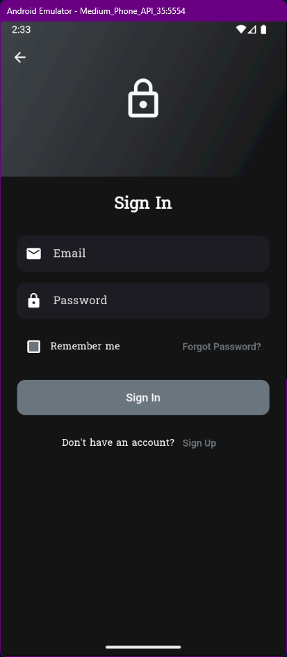
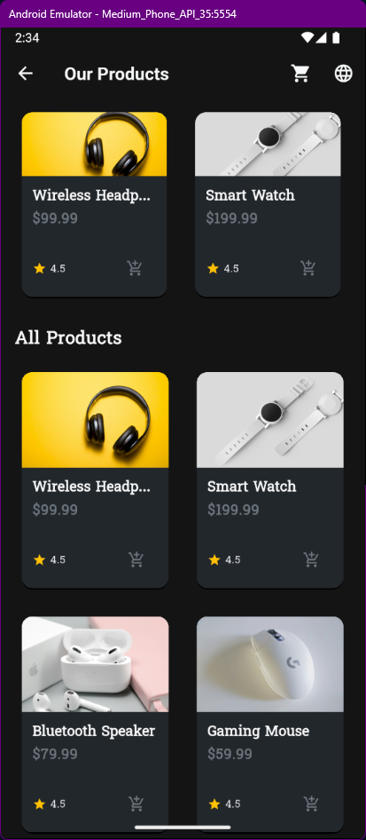
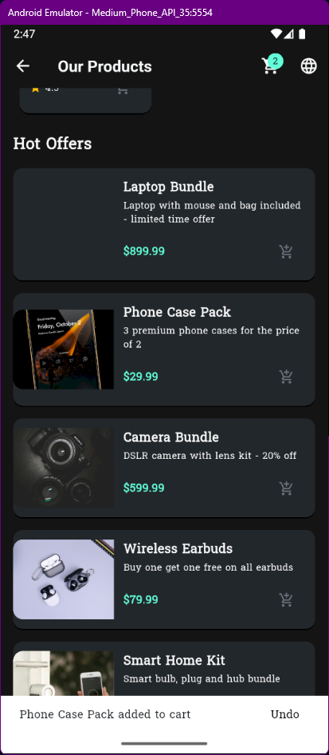
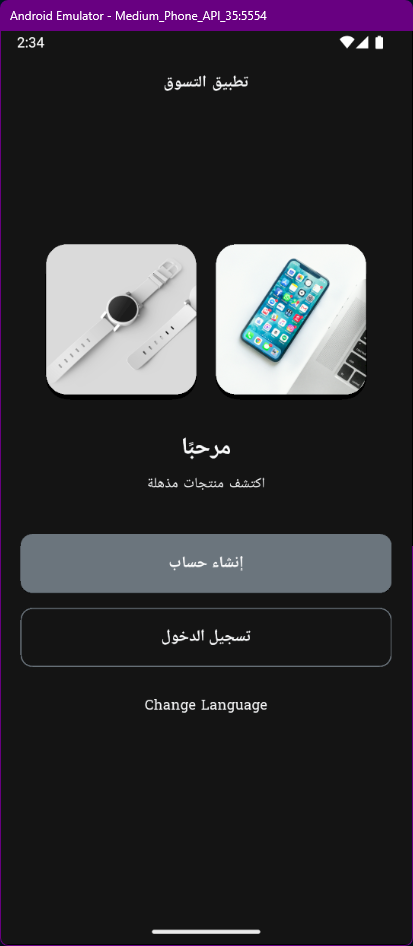
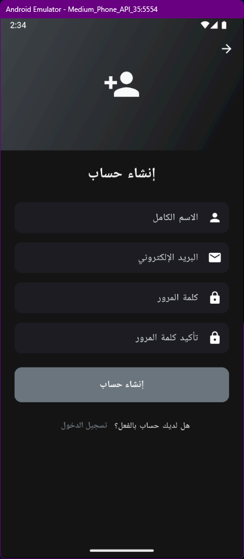
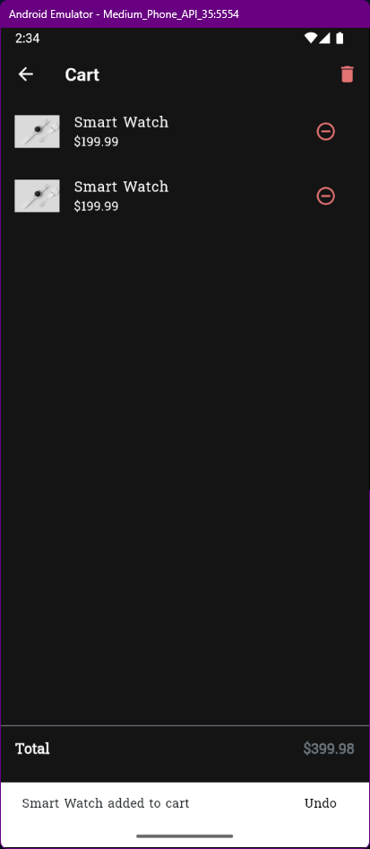

# 🛒 Flutter Shopping App Project

Hey! 👋  
My name is Ahmed Abdelnasser, I’m a 23-year-old junior software engineer from Egypt.  
This project is a complete Flutter-based shopping app built as part of a learning journey at **Sprints.AI**.

---

## 📱 About the App

This app is a **concept** for a real-world shopping application built with Dart and Flutter. It includes:

- ✅ Clean and modern UI
- ✅ User authentication (Sign Up & Sign In)
- ✅ Animated screen transitions
- ✅ Product listings (Grid & Horizontal views)
- ✅ Cart functionality with SnackBar
- ✅ Arabic language support
- ✅ Custom fonts & global themes

It’s designed to demonstrate Flutter capabilities in a professional and minimal layout.

---

---

## 🚀 Features

- 🧭 Onboarding Screens
- 🌐 Language Selection (Arabic & English)
- 🔐 User Authentication (Login/Register)
- 🛍 Product Listing with Details
- 🛒 Shopping Cart
- 🎯 Hot Offers Section
- 🧱 Reusable Widgets & Clean Architecture
- 🎨 Dark Theme Support
- 💬 Fully Localized Texts
- 💡 Animations & UI Transitions

---

## 🖼️ Screenshots

### ✅ Welcome Screen



---

### ✅ Sign-Up & Sign-In Forms

**📝 Sign-Up Screen**  


**🔐 Sign-In Screen**  


---

### ✅ Shopping Home

**🛍 Products Page**  


---

### ✅ Hot Offers

**🔥 Hot Offers**  


---

### ✅ Localization

**🌐 Language Support - Arabic**  
  


---

### ✅ Cart Page

**🛒 Cart Page**  


---

## 🌍 Tech Stack

| Tool                   | Purpose                        |
| ---------------------- | ------------------------------ |
| **Flutter**            | Main framework for UI          |
| **Dart**               | Core programming language      |
| **shared_preferences** | Local data storage             |
| **easy_localization**  | Language switching             |
| **GitHub**             | Code hosting & version control |
| **VS Code**            | Primary development IDE        |

---

## 🧱 Folder Structure

```bash
lib/
├── l10n/                # Localization files
├── models/              # Product models
├── widgets/             # Reusable UI components
├── screens/             # All app screens
│   └── auth/            # Sign-In and Sign-Up forms
├── utils/               # Constants & animations
└── main.dart            # App entry point
```

---

## 💡 Bonus Ideas

Here are a few extra features I'm planning to add:

- 🔔 Push notifications
- 🛍️ Real API integration (Firebase or custom backend)
- 🧾 Order summary page
- 🧭 Categories section
- 💳 Online payment
- 📍 Saved delivery locations
- 🧠 State management (Provider, Riverpod, or Bloc)

---

## 📬 Contact Info

**Ahmed Abdelnasser**  
📧 ahmedabdelnasser.dev@gmail.com  
🔗 [LinkedIn](https://www.linkedin.com/in/ahmed-abdelnasser-hassane/)  
🏙 Ismailia, Egypt

---
